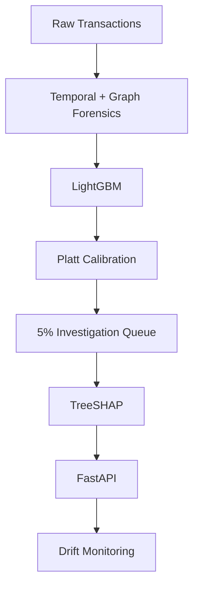

# ForensicAML

> Temporal and graph-forensic AML surveillance with calibrated risk scoring and cost-aware investigation prioritization.

## Business Problem
Financial institutions process massive transaction volumes but investigators can review only a limited subset. Static rules can miss evolving behavioral and network patterns. The system ranks transactions by illicit-risk probability using temporal behavior and transaction-network evidence, then prioritizes the highest-risk 5% for investigation. The objective is to improve illicit-case detection under a fixed investigation capacity while keeping predictions calibrated and explainable.

## Solution
ForensicAML extracts point-in-time temporal behavioral features and graph-topology forensic features from transaction networks. A LightGBM classifier estimates raw illicit risk, which is then mapped to actual expected probabilities using Platt calibration. The highest-risk 5% of transactions are flagged into a fixed-capacity investigation queue, alongside TreeSHAP explanations and drift monitoring metrics. The graph and temporal features produced modest incremental predictive lift; the project's main value is the end-to-end decision workflow.

## Architecture


## Key Results

| Metric | Result |
|---|---:|
| Out-of-time PR-AUC | 0.5526 |
| Out-of-time ROC-AUC | 0.8524 |
| Recall @ 5% capacity | 50.00% |
| Precision @ 5% capacity | 46.05% |
| Random 5% recall | 5.01% |
| Recall multiplier | 9.98× |
| Brier score | 0.0269 |
| ECE | 0.0232 |
| Scenario expected-cost reduction | 47.26% |

> Cost analysis uses scenario assumptions of $50 per investigation and $2,000 per missed illicit case; these are not observed real-world losses.

## Tech Stack
**Language**
- Python

**ML / Statistics**
- LightGBM
- scikit-learn
- Platt scaling
- TreeSHAP

**Graph / Forensics**
- NetworkX
- temporal behavioral feature engineering

**Data**
- pandas
- NumPy
- SciPy
- Joblib

**API**
- FastAPI
- Pydantic

**Testing**
- pytest

## Method
- Chronological train / validation / future-test split
- Point-in-time-safe graph and temporal features
- Unknown-label transactions excluded from supervised training
- LightGBM for tabular risk modeling
- Platt scaling for probability calibration
- Top-5% fixed-capacity investigation policy
- TreeSHAP for local explanations
- PSI / KS / performance monitoring for drift

## Dataset
- [Elliptic++ public research dataset](https://github.com/git-disl/EllipticPlusPlus)
- 203,769 transaction nodes
- 49 time steps
- 234,355 transaction edges
- Label 1 = illicit
- Label 2 = licit
- Label 3 = unknown
- Unknown labels excluded from supervised training/evaluation
- Available graph nodes/edges retained for graph construction

## Explainability
> TreeSHAP provides local feature contributions for individual predictions, allowing investigators to inspect which model features increased or decreased the estimated illicit-risk score.

Example output:
```json
{
  "feature": "in_degree",
  "value": 14.0,
  "contribution": 0.124
}
```
*Note: SHAP explains model behavior, not criminal intent.*

## API
- `GET /health`
- `POST /v1/score`
- `POST /v1/explain`

Example response:
```json
{
  "transaction_id": "tx_1",
  "calibrated_probability": 0.1652,
  "decision": "INVESTIGATE",
  "policy": "Fixed 5% Capacity (Threshold: 0.1526)"
}
```

## Validation
- Chronological evaluation and point-in-time leakage checks
- Full graph preservation and graph/SCC audit
- Feature ablation and calibration comparison
- Drift monitoring and untouched future test evaluation

> Graph and temporal forensic features added only modest incremental predictive lift over the raw tabular baseline.

## Project Structure
```text
forensic_aml/
├── app/
├── src/
│   ├── ingestion/
│   ├── features/
│   ├── models/
│   ├── evaluation/
│   ├── explainability/
│   ├── inference/
│   └── monitoring/
├── scripts/
├── artifacts/
├── data/
├── reports/
└── tests/
```
