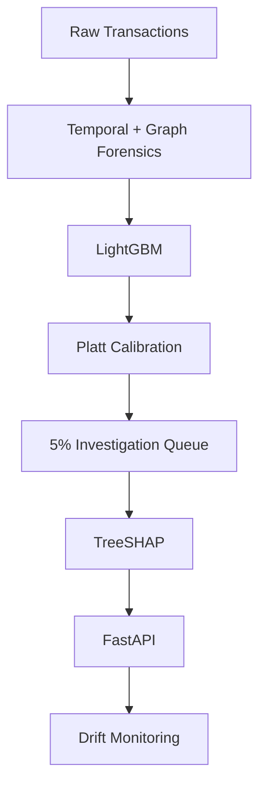

# ForensicAML

> Temporal and graph-forensic AML surveillance with calibrated risk scoring and cost-aware investigation prioritization.

## Overview / Business Problem
Financial institutions process large transaction volumes while investigators can review only a limited fraction of activity. Static rules can miss evolving behavioral and network patterns. The system ranks transactions by illicit-risk probability using temporal behavior and transaction-network evidence, then prioritizes the highest-risk 5% for investigation. The objective is to improve illicit-case detection under a fixed investigation capacity while keeping predictions calibrated and explainable.

## Solution
ForensicAML extracts point-in-time temporal behavioral features and graph-topology forensic features from transaction networks. A LightGBM classifier produces risk scores, which are calibrated using Platt scaling on a temporally held-out validation period. The highest-risk 5% of transactions are flagged into a fixed 5% investigation queue, alongside TreeSHAP explanations and drift monitoring metrics. The graph and temporal features produced modest incremental predictive lift; the project's main value is the end-to-end decision workflow.

## Architecture


## Key Results

| Metric | Result |
|---|---:|
| Out-of-time PR-AUC | 0.5526 |
| Out-of-time ROC-AUC | 0.8524 |
| Recall @ 5% capacity | 50.00% |
| Precision @ 5% capacity | 46.05% |
| Random 5% recall | 5.01% |
| Recall multiplier | 9.98× |
| Brier score | 0.0269 |
| ECE | 0.0232 |
| Scenario expected-cost reduction | 47.26% |

> Cost analysis uses scenario assumptions of investigation cost = $50 and loss cost = $2,000; these are scenario assumptions, not observed real-world losses.

## Tech Stack
- Python
- LightGBM
- scikit-learn
- Platt scaling
- TreeSHAP
- NetworkX
- pandas
- NumPy
- SciPy
- Joblib
- FastAPI
- Pydantic
- pytest

## Method
- Chronological train/validation/test split
- Point-in-time-safe graph and temporal features
- Unknown-label transactions excluded from supervised training
- LightGBM for tabular risk modeling
- Platt scaling for probability calibration
- Top-5% fixed-capacity investigation policy
- TreeSHAP for local explanations
- PSI / KS / performance monitoring for drift

## Dataset
- [Elliptic++ public research dataset](https://github.com/git-disl/EllipticPlusPlus)
- 203,769 transaction nodes
- 234,355 transaction edges
- 49 time steps
- Labels:
  - 1 = illicit
  - 2 = licit
  - 3 = unknown
- Unknown-label transactions are excluded from supervised training and evaluation
- Available unknown nodes/edges are retained in graph construction where applicable to preserve network context

## Explainability
> TreeSHAP provides local feature contributions for individual predictions, including custom temporal and graph features where they influence the model.

Example output:
```json
{
  "feature": "in_degree",
  "value": 14.0,
  "contribution": 0.124
}
```
*Note: SHAP explains model behavior, not investigator/legal intent.*

## API
- `GET /health`
- `POST /v1/score`
- `POST /v1/explain`

Example response:
```json
{
  "transaction_id": "tx_1",
  "calibrated_probability": 0.1652,
  "decision": "INVESTIGATE",
  "policy": "Fixed 5% Investigation Queue",
  "implied_population_cutoff": 0.1526
}
```

## Validation
- Chronological train/validation/test split
- Point-in-time-safe graph and temporal features
- Graph edge temporal audit
- Feature ablations
- Calibration evaluation
- Drift monitoring
- Untouched future test set
- Graph SCC/cycle validation where relevant

> Graph and temporal feature ablations produced modest incremental out-of-time lift over the raw tabular baseline.

## Project Structure
```text
forensic_aml/
├── app/
├── src/
│   ├── ingestion/
│   ├── features/
│   ├── models/
│   ├── evaluation/
│   ├── explainability/
│   ├── inference/
│   └── monitoring/
├── scripts/
├── artifacts/
├── data/
├── reports/
└── tests/
```

## Limitations
- Elliptic++ is a public benchmark dataset, not a live banking transaction environment.
- The scenario cost model uses assumptions.
- Forensic feature lift is modest.
- Production deployment would require institution-specific data, controls, governance, and monitoring.

## Reproduction
To run the test suite and verify frozen artifacts locally:
```bash
pip install -r requirements.txt
pytest tests/
```

## License
MIT License
